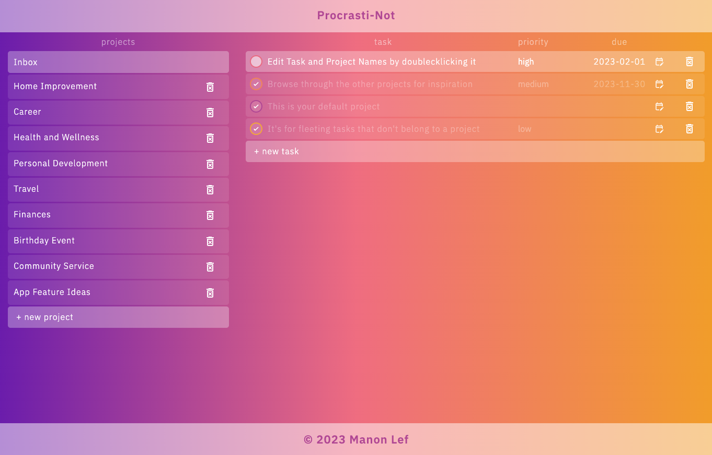

# To-Do App Procrasti-Not

## Result
[Try the Procrasti-Not app live here](https://manonlef.github.io/To-Do-App/)

## About this project
For this Project it was required to build a functioning to-do app using a modular design pattern. I went for an ES6 modules oriented approach. Compared to the previous projects, this one is pretty lengthy. I used ESLint, Prettier, Webpack and tried implementing an MVC setup by doing some research about this.

The project is optimized for Chrome on a regular screen. Some mobile display adjustments have been made, but much of the editing functionality is lost due to it not being made responsive at this point.

## Instructions/Behavior April 2023:
- The Inbox will be the default project
- New Projects can be made
- New tasks can be created inside the selected project
- After creation, The names of both the tasks and projects can be changed by double clicking them
- All projects and tasks can be deleted by clicking on their corresponding bin (they will be gone without warning for now though so be careful)
- A default setup of projects and tasks will be loaded upon first usage of the app
- Changing the priority can be done by clicking on said priority
- Changing the date can only be done by clicking on the calendar edit icon
- Tasks are sorted by incomplete first, then by due-date

## Objectives
- [x] to-do's are dynamically created objects
- [x] each to-do has at least the following:
  - [x] title
  - [x] due date
  - [x] priority
  - [x] description (which I removed in the final design for aesthetic purposes)
- [x] separate lists in the form of projects
- [x] default project during startup
- [x] users should be able to create new projects and put to-do's in the project of their choice
- [x] application logic should be separate from the DOM logic
- [x] The UI should show all projects
- [x] UI: show all to-do's in a selected project (only title/due date)
- [x] UI: expand a single project to see/edit other details (changed design to show all details)
- [x] UI: delete a todo
- [x] make use of local storage and prevent it from crashing when there's none available

## extra functionality implemented not in the objectives
- [x] project deletion
- [x] task ring color change based on priority
- [x] vault creation for scalability in the future towards multiple users or areas

## Notes and Lessons Learned
To be honest I'm not sure where to begin. This project was huge! It was a lot more code and new functionality to keep track of all at once. But I'll give it a shot and extract some of the main things worth a mention.

- **Project Notes:** I've taken a lot of notes during this project with near-daily updates that can be found [here](../resources-and-notes/notes.md).

- **MVC Pattern:** I spent a good amount of time planning out my code and trying to learn about the MVC pattern. I considered where I wanted every bit of my functionality to end up and which module would see what. Eventually I ended up with separate classes modules for vault, project and task. The **Model** handling all the data, data editing and storage. The **View** handling UI and UI change event listeners only, and the **Controller** delegating all the tasks that needed to be done after user interaction requiring data retrieval from the Model to send to the view and getting the required renders and the event listeners back in place. I can't be entirely sure this is a good implementation of the MVC, but it did make me think a lot more about scalability and modularity and organization of code.

- **SOLID:** I have not yet fully grasped all the design principles layed out here, but here's my interpretation of how I implemented some ideas from it during my ongoing studies.
  - Single responsibility: I've tried to make as many separate functions with only one task or purpose. 
     - Information holders: I've created the classes and projects and functions serving only the purpose of returning or storing one bit of information
    - Structurers: I've created the vault holding all projects, which in turn hold all the to-do items. 
    - Coordinator: This would probably be my controller. The controller gets data from the model, which it can use to send to the view. The controller also receives data from the user interactions, after which it can send specifics to the model to update and the view to render.
  - Open/Closed: I think I've made some container functions that gather other functions that might go against this principle. I will study this more. I'm thinking some subfunctions in my renderAll() function specifically, that does all tasks in sequence needed after a rerender of a project. adding another project listener would require me to add it to a bundled collection of projectListeners as well. I liked keeping the eventlisteners separate, but in hindsight it might adhere to open/closed better if I put all the project listeners inside their own function to be invoked by the renderer.
  - Liskov: I didn't feel I could implement the testing and contracts ideas much. I did find during the project that I really would have liked to know more about setting up tests however. Especially in the starting phase where everything just wasn't as modular yet as I wanted. It was sometimes hard to trace back when a new problem was introduced. Being able to have specific tests run after changes to the code for certain *high-traffic* parts of it would have been a lifesaver. I did try to avoid using inheritance, but then again, I made little use of inheritance beyond class properties.
  - Interface Segregation: I've removed unused functions and functionality as much as I saw fit for now. I also tried to minimize coupling or made it flexible depending on the parameters being passed. I commented some functionality out for later use. While JS doesn't have an interface perse, I tried approaching this from a code perspective with someone else trying to make sense of and find use in parts of said code.
  - Dependency Inversion: relevant to JS: high level modules shouldn’t depend upon low level modules. I think this part is largely covered by the usage of ES6 Modules and only importing what's needed. For my MVC setup, my main component is the controller. It obviously needs a lot of data from the model to then send said data in one bundle to be rendered. 

- **Cross Bowser Form Behavior:** That's not a typo. Forms were really the endgame boss here. When my project seemed as good as complete, I opened it up in both safari and firefox. It weren't just the styling differences I was worried about, since styling is basically optional for this project, it was the focus behavior within the forms. In Firefox the form related elements would register as out of focus (and close by my approach of a modal design) when inside the date picker, and safari would do the same with the checkbox. I eventually went with a much different approach for my listeners and made it a document click event listener outside the form only and only when the form was open. 

- **Event Listeners:** Something I did spend a lot of time on. Especially with clashing listeners and tracking which ones influenced the other ones. A lot of new event properties were met and I got a really good chance here to learn about them a lot more. All stages of a click and focus event for example, the bubbling and console.log wealth of information that can be gathered. I did make some functions differentiate between a single and double click event as well.

- **PubSub:** Something I really wanted to work with but haven't really implemented. I thought I would, but as my code started evolving naturally with my pseudocode, I didn't really see a need to take a deeper dive into it yet. 

- **Local Storage:** This was my first time working with it. What a joy to be able to store data! I ended up using a bit of a simplified method to store the whole vault all at once, and removing it before storing it again on each change. I was confident I could manipulate the data storage string bit by bit, but decided for this project that would not be worth the time I would spend throughout this whole project on implementing that. That time would be best spend on learning new things that would get me to more reliable data storage. I have yet to implement some catches for possible errors resulting from local storage limits on private sessions or user settings.

- **Plans Changed:**
  - I wanted and implemented a form for editing that replaced the current task element. I eventually stopped for the amount of code for just the DOM/styling/aesthetics was becoming a bit ridiculous. I did commit some of it for future reference but then reverted it for again, I felt I was wasting valuable time on nifties and form fighting. I instead went with something maybe even more elegant with the inline/contenteditable option.
  - I wanted to change the default form date design. I am not sure how I got out of that rabbit hole. Eventually I went with a calendar icon only to avoid the input date. And I displayed the date next to it. This quite possibly has some accessibility concerns, but right now I did not optimize any of the project for that really, sans the labels I added to everything.

- **Styling:** Styling takes so much longer than I think. It gets me every single time. It's not the difficulty, but it just takes so much planning. I did look into media queries for this project but quickly decided I already went way over MVP and will leave that for later.

## Features or things I'd love to work on for this project in the future
- [ ] refactor the code and get rid of unused UUID classes
- [ ] look into accessibility concerns
- [ ] add a sort option for priority
- [ ] add a trashbin for deleted projects and tasks
- [ ] add the option to change tasks to another project
- [ ] create date projects/filters for today and this week
- [ ] implement more local storage errors
- [ ] format the displayed date and time
- [ ] mobile responsive update
- [ ] add different theme options (including a higher contrast one)
- [ ] flag over-due (credit: suggestion by Moomins on discord)

