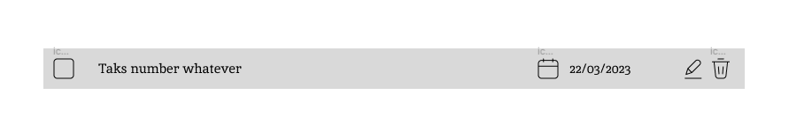

## 20230318

To be honest I'm massively intimidated by this project. Not because of the project description, but because of all the chats I've seen about this project in the TOP Discord. Apparently it's just a very big project. Curious how I'll experience it.

- I set up webpack first just like I did for the restaurant project.
- I went for a basic setup again since I expect to be mostly focusing on code first and not the UI or DOM items. When I get there i'll add the styleloaders etc.
- Then I followed my ESLint/Prettier setup workflow.
  - I had to pick between regular JS (import/export) and CommonJS (require) I believe. I picked regular but saw ESLint throw an error in the webpack config due to the require in there. I've added an `.eslintignore` for now for the webpack.config file.

### Organization Brainstorm.
- I want to make this code as modular as I can and revisit the SOLID principles as I go to see if I understood them and can implement them.
- I'll install my things3app to see how it works again
- separate the DOM entirely from the scripts/modules
- Object Role Stereotypes from [this article](http://aspiringcraftsman.com/2011/12/08/solid-javascript-single-responsibility-principle/) and how I think they translate to this project:
  - Information holder: an object designed to know certain information and provide that information to other objects.
    - the created to-do items
    - maybe the projects
  - Structurer: an object that maintains relationships between objects and information about those relationships.
    - maybe an array of collection of projects and their to-do's. Able to change todo's from one project to another
  - Service Provider: an object that performs specific work and offers services to others on demand.
    - not sure about this one, perhaps things like edit buttons, deletion options
  - Coordinator – an object that doesn’t make many decisions but, in a rote or mechanical way, delegates work to other objects.
    - like a controller perhaps? When a button is pressed it determines and delegates? Event listeners for example?

## What broad modules do I expect to have and what will they do?

### projects module
- create and manage projects 

### to do module
- will create and manage all the todos, add, delete, edit

### UI/viewport module
- will contain all the DOM stuff

## End of day
- I have mostly worked on the project and task module.
- the tasks get created in the to-do-manager module and are then sent to the project-manager module for further processing.

For later: 
- [x] for the addTaskToProject function, add some sort of check if the project is an existing one, not being inbox.
- [x] consider some sort of controller in between. Tasks get sent there, it decides how it should be sent to the project manager. It should probably have access to some kind of storage module as well where all the projects are stored.

## 20230319 
- I added a check for existing project not being inbox. The addTask to project function now does have a bunch of if/else which I think is not desirable. Will have to ponder an alternative setup. 

Things to probably create:
- [x] function to remove a project
- [x] function to return all tasks
- [x] function to remove a task from a project
  - [x] add task property unique id to accomplish this
- [x] getters and setters for every needed task property

## 20230319-2
- I made a basic form to play around a bit with ui 
- ~~set task project to inbox when none defined.~~

## 20230320
After sleeping over the setup I still felt something was missing from my code. Some functions still end with calling another function. I feel like a pubsub kind of implementation would be nicer but instead of handling this with a plugin, I'd much rather set up a different way. And I'm thinking of implementing a controller that gathers information from the other modules and uses said information.

### Pseudocode example a new task gets created:
- User presses new task button and a form pops up > DOM
- User enters details and hits submit > data entered will be transformed to an array > listener in controller?
- array will be used to create a task > controller > to do module
- to do module will send back the created task to the controller > to do module > controller
- controller will send this data to the project manager to store it in the correct project. controller > project module

### After pseudocode implementation
- the above starts feeling very unintuitive. Perhaps I should start considering adding classes inside the projects upon creation. Which would basically mean someone should first create a project before tasks can be added to it. I'll try to rewrite it as such for that way the project could be filled with tasks from the project module only.

## 20230322 Local Storage Jump
I have been working mostly on refactoring the code, worrying about closure, global storage, limiting cross dependency etc.

All in all very happy about the progress the basic functionality was in place quite quickly. Some issues with local storage were to be expected:
- the String parsing output the array of objects nicely. But the objects made from classes lost their prototype functions. This was rather quickly fixed by setting their prototype again.

- [ ] Don't forget to remove dev mode for the final build

### UUID
I'm looking into UUID generation. I am planning to use this uuid for targeting specific tasks eventually.
- I decided to go for a simple `new Date().getTime().toString()` id creation. There are multiple uuid generators but I feel like it's overkill for this usage.

## 20230324

I want to start taking the first steps into the viewport planning for now.
Things to consider:
- what information from the `controller` does the DOM need to be able to render? export just that plain info as needed with the needed uuid to identify input actions
- to render ideas:
  - projects created
  - when clicking on a project: tasks in said project

### Still Needed functionality before I move to DOM
- [x] create a function to return only the tasks inside a project
- [x] marking todo's as complete
- [x] function to change project name
- [x] function to change task name
- [x] function to remove a project
- [x] function to remove a single task
- [x] function to target a task by uuid

## 20230326

### Pseudocode for project list render
- render all projects in a list
- add event listeners to each project
- once a project is clicked, render all tasks from said project

## 20230327 create task design and implement current project state

- above roughly implemented
- I added a current project state. I think that will come in handy when adding a task based on current project selected.
- [x] go through project selection and task assignment based on projectUuid

### 20230327 
- I implemented a model module today for I think it's more convenient to keep storage and variables separated as much as possible. I also read up a bit on MVC and think this is the best approach. Most of the time so far actually went to organizing the code I believe. 
- I think the next step is considering if any of the helper functions are needed and also focus more on having the uuid's of both the project and task. Keep in mind I may want to have a tab showing all tasks in one view and similar for dates due.

## 20230328 
- I'm changing the form to not include project. The functions will assume current project.
- [x] add function / option to add a new project

- started working on rendering function in view
- [x] move some functions from controller to model

## 20230329
- [x] add function to remove project
  - [x] enable the delete buttons for testing (ensure their classnames are unique and not the same as other buttons)
  - [x] add eventlisteners to said delete button (make them console log for now)
  - [x] add the delete button eventlisteners upon render
  - [x] start with a function in the controller to get the uuid from the delete button on a project
  - [x] get the project index from said ID
  - [x] create a function in model to remove a project 
  - [x] export that function from model and import to controller
  - [x] make default project the current project

- [x] empty new project form upon submit
- [x] consider model function to set current project to the default project

## 20230329-2
- [x] recreate task form in DOM
- [x] add button to open project add form:
  - [x] on click of that button:
    - [x] open form 
    - [x] add event listener (was not needed since the element is already there)

## 20230330 
- [x] rename task form submit class
- [x] empty task form on submit
- [x] reorganize task container to mirror project setup
- [x] add button to add task (check workflow project hide/un-hide)
  - [x] add `addTaskicon` function
  - [x] add hide and un-hide functionality for form when clicking the button
- [x] add hide and un-hide for task icon when form is open
- [x] add checked task styling
  - [x] add checkmark to task as value
- [x] create function to edit project name
- [x] create visuals to edit project name
  - [x] consider adding a hidden form in the spot of that project that hides and un-hides with edit fields that submit on enter
- [x] look into `form.reset()` instead of my current functions to clear the form
  - [x] use `form.reset()` for project submit as well
- [x] add event listener to checkbox on render to add classname

### end of day notes
- I ran into some issues when adding event listeners for blur and focusout. It made the click eventlisteners malfunction. Eventually I fixed that by using a mousedown event instead of click. I'm still not entirely sure what caused it so I'd like to look into that 
  - ~~[ ] look into the above issue for research~~
  - ^ two event were firing a function simultaneously
- It's getting a lot harder to keep track of all the different elements. I'm glad I separated many of the concerns during the earlier stages and took my time to achieve some sort of organization and responsibilities for my modules.

### Extracted to-do's to carry over to next days
- [x] look into errors upon deleting last project or make sure the first project default is non-deletable 

## 20230331
- [x] add function to move all checked items to bottom of the list
  - [x] test lodash sortBy

## 20230402
### Carried over tasks:
- [x] add color/style to current project in project list
- [x] create function(s) to edit a task 
  - [x] create function to edit checked status of a specific task
- [x] function to change task priority
- [ ] function to change dueDate
- [x] add color to task div based on priority

## future ideas
- [ ] move deleted items to a trashbin
- [ ] create a function to filter based on priority
- [ ] look into date-fns for formatting and manipulating times/dates [here](https://github.com/date-fns/date-fns)
- [ ] consider option to remove project but move tasks to the inbox
- [ ] create a function to filter on today's date

Today I ran into a bunch of issues suddenly with my single and double click events clashing for editing the project names. I still haven't figured out where that came from all of a sudden. I went and rewrote and transfered the edit part to the controller to get it fixed. However, I really prefer the view to handle this.
- ~~[ ] look into creating an edit state for project where it picks which fields or elements are shown.~~

## 20230403
- I will get started on rewriting the above. Probably wrapping them both in their own section and basing which one to show on edit state.
- another issue and error I came across. The project Edit didn't work on enter anymore. I needed to add the click event but that has the issue of throwing the following error:
`Failed to execute 'removeChild' on 'Node': The node to be removed is no longer a child of this node. Perhaps it was moved in a 'blur' event handler?` 
also mentioned [here](#end-of-day-notes) 
This seems to be caused by the form submit 

- the above is finally fixed after a lot of debugging:
  - the focusout and click event were both fired upon click.
  - I now remove the focusout listener in case it was a click event
- then there was another error with the form not being connected. What happened was the form submit was firing (even though I had submit/return false set as attribute)

## 20230404

- I will start today by making the forms (add project and tasks) exitable while clicking out  of them or maybe hitting esc
- [x] make add project form dissapear when clicking outside.
- [x] ISSUE addProject function jumping to first item with said project name
  - when you add a project, it will make the project active by name. When you add a project with the same name as a previous one, it will jump to the first one in the array. Consider using the vault projects array last item instead.
  - fix [April 6th](#20230406)

- I used contenteditable for the taskname field which worked out lovely. 
- I want to refactor the project name edit to do the same thing. Sadly that one took me a lot of time to set up but this task edit approach seems so much cleaner and more reusable.

### transferred task
- [x] consider form being necessary or just using the input field instead without it being a form for the change of project name.
- I can test the above on the task editing 

- today I tested this on task name editing and no, the form isn't needed. The task edit is a whole lot cleaner not having to deal with a form

## 20230404 continued
- [x] refactor project edit to same as task name edit
  - [x] remove hidden form from the view
  - [x] remove all associated functions in view
  - [x] remove associated listeners in controller
  - [x] add listeners for edit similar to task edit

- [x] make new task form dissapear on focusout or esc similar to project form

## 20230406 
- [x] display the priority on the tasks rendered
- [x] remove description visuals for now on rendered tasks
- [x] add function to change priority
- [ ] Optional: add sort by priority option

- FIX new project with same name making first of name active project. Added a function to return the latest project ID and set that as active after adding a project.

- add project button not working (has to do with the focusout listener again)

## 20230407
- had some struggles with styling the datepicker. I did implement the datepicker change listener.
- eventually used this guide [here](https://dev.to/codeclown/styling-a-native-date-input-into-a-custom-no-library-datepicker-2in) to style my datepicker as I intended.